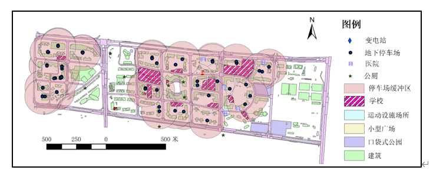
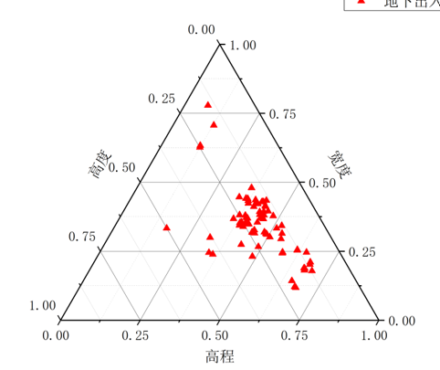
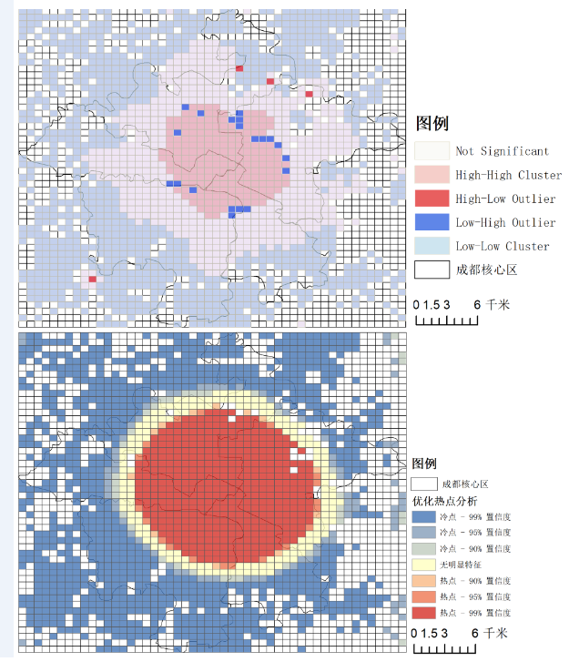
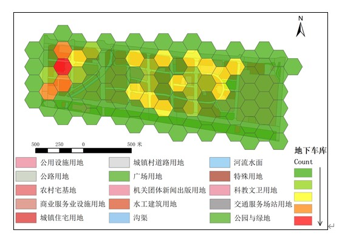
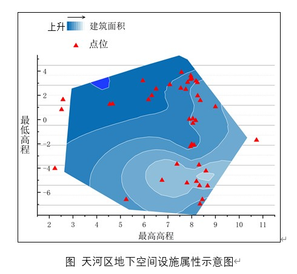

# 依稀江南

江南一直寄托着中国文人最美好的想象。
迷离的烟雨，款款动人的姑娘。
DAY1:***上海***
<br>
<font face="黑体" color=black size=3>loading</font>
+ 纸醉金迷的国际化大都会，早在前清开埠，上海就成了东南富庶区域对外交流的桥头堡，偌大个中国，养活一个超级城市还是够的，这里有着最接近西式的经济条件与文化氛围，在被西方文化同化与影响的同时，也提供了便捷的生活条件。只有丰富的物质供给才能提供文化滋生的土壤，上海犹如一个巨大的吸泵，吸引了全国优秀的人才大师在此定居。
+ 从杭州到上海虹桥，上海虹桥是机场、高铁、汽车结合枢纽，

<font face="黑体" color=black size=3>西塘</font>
<br>


+ 看到了乌篷船，这才到了水乡，江南水乡的典型意象无非是油纸伞的姑娘，与姑娘工程

+大运河
京杭大运河
第一次见到运河
##运河是
尽到隋亡为此河
依然有漕运
专门开发出的平底运河船只

<!--  -->
<br>


漂亮的三元图与丑丑的缓冲区

冷热点，H-L区域果然是神器，2020来啦，要把bug留给后人
狗头jpg，总之一切都还好，也很好，希望会更好
flag 希望毕业旅行能出国玩


为什么，pycharm的脚本名称加上test_就会成为debug
模式呢？



#1
##1
# 一级标题   
## 二级   
### 三级  
####  四级 
##### 五级 
###### 六级
测试
123
+ wrw
+ wfe
+ wfr

```` <pre>
import coding
代码区
````

一一江南|武汉|测试 <table>

武汉
<hr>分割<hr>
<p><br>
<p>
1
<br>
换行<br>
1：标题(# h1-h6)
2：字体（* ** *** ～～）
2：空格、段落和换行(<p><br>)
3：超链接([]() <a>)
4：图片(`[图片上传失败...(image-150c9b-1534497144672)]和公式
5：列表(<ul><ol><li>)
6：代码块(```` <pre>`)
7：着重、强调(** <em><strong>)
8：表格(-|-|- <table>)
9：转义字符(\)
10：分隔线(--- <hr>)
