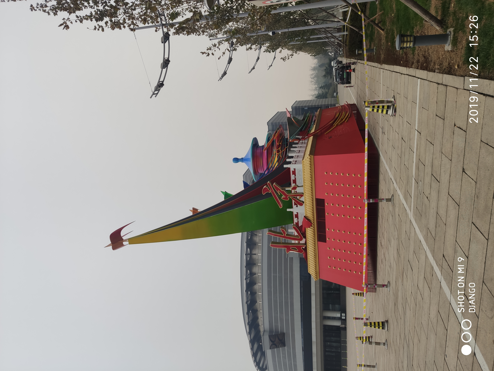
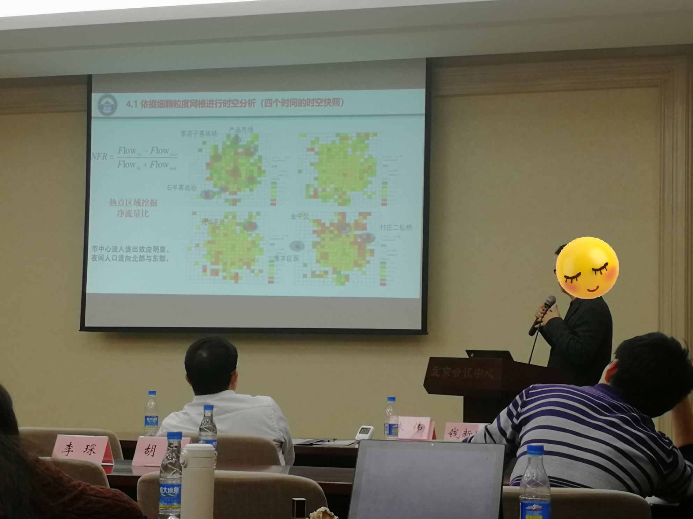

#北京

#### DAY1:***会议中心***

开心哇
唯一遗憾的是应该拿我的台风山竹的成体系
打磨很久的模型来做汇报的，明明是论文汇报，结果大家都是
项目汇报。

除了做了第一次汇报，其他的也是很有收获的
方志祥老师做的双向，联想记忆神经网络印象很深。
给我的舆情数据与分布图的之间关联挖掘提供了一个思路
我为了找关联性，甚至想去做支持度置信度的挖掘。

这个方向我很感兴趣，这次开会我还做了一个时空立方体的PPT
突然想到可以用，每个层级的编码。来进行深度学习，word2vec词嵌入。

舆情：关注点分布、关注区域分布、关注密度分布、舆情情感特征
灾害空间分布：浒苔生长趋势、浒苔漂移轨迹、浒苔扩散范围
（灾害发生区域、灾害影响范围、降雨量分布）
我觉得是很好的idea，基于时空立方体解决了向量化问题。

11.27更新
好忙啊！！各种事，广东的图又修改了，本科小孩有的是很较真
从66给分加到80，下午还去陪别人修了个电脑，看了看照片感觉在武大
度过了好久哇！！